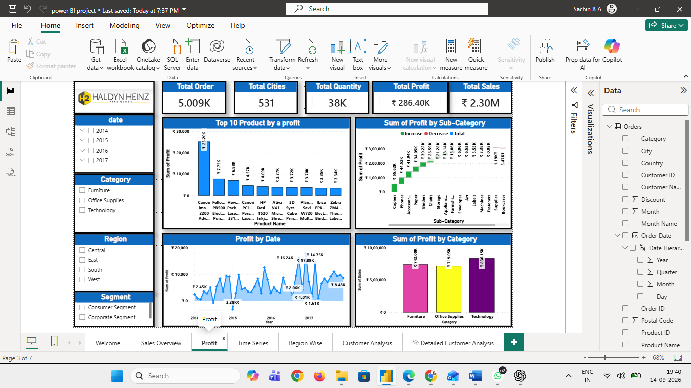

# 📊 Sales Analysis Dashboard | Power BI

An interactive Power BI dashboard for exploring sales, profit, customers, products, regions, and time-based business performance.


## 🚀 Project Overview

This project demonstrates a complete business intelligence workflow in Microsoft Power BI: data preparation, transformation, modeling, KPI development, interactive visualization, and business-focused analysis.

The dashboard is designed to help users quickly understand **sales performance, profitability, customer behavior, product performance, regional trends, and changes over time**.

## 🎯 Business Objectives

- Monitor overall sales, profit, orders, and quantity
- Identify sales and profit trends over time
- Compare performance across regions, states, cities, and countries
- Analyze category, sub-category, and product performance
- Understand customer and segment-level performance
- Build an interactive dashboard for business decision support

## 🛠️ Tech Stack

| Area | Tools / Techniques |
|---|---|
| BI Platform | Microsoft Power BI |
| Data Preparation | Power Query |
| Data Modeling | Relationships, dimensional analysis |
| Calculations | DAX |
| Visualization | KPI Cards, Charts, Tables, Maps |
| Analysis | Time, Geography, Products, Customers, Segments |

## 📊 Dashboard Preview

### Welcome

Navigation page for accessing the different dashboard sections.


### Sales Overview

High-level view of sales performance across the business.


### Profit Analysis

Explores profitability across products, categories, sub-categories, and time.



### Time Series Analysis

Tracks sales performance across the available time period, from **2014 to 2017**.


### Regional Analysis

Examines sales performance across regions and geographic dimensions.


### Customer Analysis

Provides customer-level analysis of sales, profit, quantity, and order activity.


## 📈 Key KPIs

The dashboard includes metrics such as:

- **Total Sales:** ₹2.30M approximately
- **Total Profit:** ₹286.40K approximately
- **Total Quantity:** 38K approximately
- **Total Orders:** 5.009K approximately
- **Total Customers**
- **Total Cities**

> KPI values above reflect the figures documented in the dashboard README and may vary with filters or report interactions.

## 🔍 Analysis Areas

### Time
Year, quarter, month, and date-level analysis.

### Geography
Region, state, city, and country analysis.

### Products
Category, sub-category, and product-level analysis.

### Customers
Customer ID, customer name, and segment analysis.

## 🎛️ Interactive Features

- Slicers and filters
- KPI cards
- Drill-down analysis
- Interactive charts
- Tables and detailed views
- Geographic visualizations
- Time-based filtering
- Category, region, and segment filtering

## 💡 Business Questions Answered

- How are sales and profit performing overall?
- How does sales performance change over time?
- Which regions contribute most to sales?
- Which categories and products perform strongly?
- How does profitability vary across products and categories?
- How do customer segments compare?
- Which customers and orders contribute to business performance?

## 📁 Repository Structure

```text
Sales-Analysis-PowerBI/
│
├── README.md
├── Sales_Analysis_Report.pbix
│
└── Screenshots/
    ├── Welcome.png
    ├── Sales Over VIew.png
    ├── Profit.png
    ├── Region Wise.png
    ├── Time Series.png
    └── Customer Analysis.png
```

## ▶️ How to Use

1. Download `Sales_Analysis_Report.pbix` from this repository.
2. Open the file with **Microsoft Power BI Desktop**.
3. Interact with the slicers, filters, and visuals to explore the analysis.

## 📌 Project Highlights

- Built an interactive multi-page Power BI dashboard
- Used Power Query for data preparation and transformation
- Applied DAX for analytical calculations
- Created business-focused KPI and visualization views
- Organized analysis across time, geography, products, and customers

## 👤 Author

**Sachin**  
Data Analytics | Power BI | SQL | Python

📌 GitHub: [@Sachijhon](https://github.com/Sachijhon)
