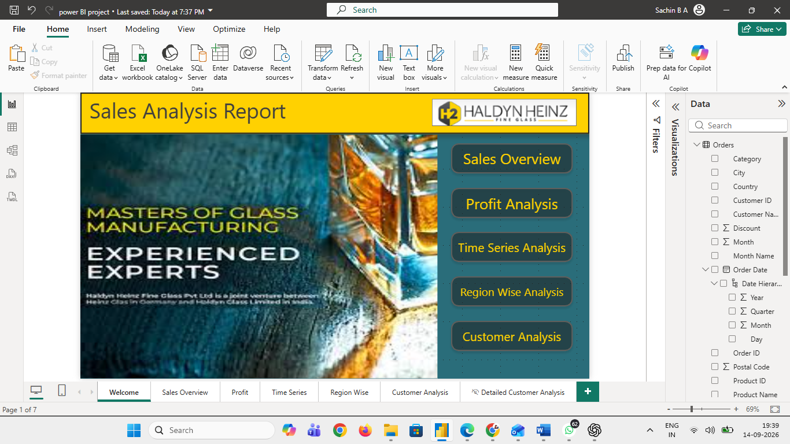

# 📊 Sales Analysis Report — Power BI

## 📌 Project Overview

Sales Analysis Report is an interactive Business Intelligence dashboard developed using Microsoft Power BI.

The project analyzes sales, profit, quantity, customers, products, categories, regions, and time-based performance. Interactive dashboards and filters are used to transform sales data into meaningful business insights.

## 🎯 Objectives

- Analyze overall sales and profit performance
- Track sales trends over time
- Analyze sales across different regions
- Understand customer performance
- Compare product and category performance
- Analyze sales by segment
- Create an interactive business intelligence dashboard

## 🛠️ Tools Used

- Microsoft Power BI
- Power Query
- DAX
- Data Cleaning
- Data Modeling
- Data Visualization

## 📊 Dashboard Pages

### 1. Welcome

The welcome page provides navigation to the different analysis sections of the report.



### 2. Sales Overview

Provides an overview of sales performance across regions and categories.


### 3. Profit Analysis

Analyzes profit performance by product, sub-category, category, and date.


### 4. Time Series Analysis

Analyzes sales performance over time using date-based visualizations.

The analysis covers the period from **2014 to 2017**.


### 5. Region Wise Analysis

Provides geographical analysis of sales across regions, states, and countries.


### 6. Customer Analysis

Provides customer-level analysis including sales, profit, quantity, and order details.


## 📈 Key KPIs

The dashboard tracks important business metrics such as:

- Total Orders
- Total Customers
- Total Cities
- Total Quantity
- Total Profit
- Total Sales

The dashboard displays approximately:

- **5.009K Orders**
- **38K Quantity**
- **₹286.40K Profit**
- **₹2.30M Sales**

## 🔄 Data Analysis

The report provides analysis across:

### Time
- Year
- Quarter
- Month
- Date

### Geography
- Region
- State
- City
- Country

### Products
- Category
- Sub-Category
- Product

### Customers
- Customer ID
- Customer Name
- Segment

## 🎛️ Interactive Features

The dashboard includes:

- Interactive slicers
- Date filters
- Category filters
- Region filters
- Segment filters
- Drill-down functionality
- KPI cards
- Charts
- Tables
- Geographic visualizations

## 💡 Business Questions

This dashboard helps answer questions such as:

- What are the overall sales and profit levels?
- How do sales change over time?
- Which regions generate higher sales?
- How does each category perform?
- Which products contribute to profit?
- How do different customer segments perform?
- Which customers and orders contribute to sales?

## 📁 Repository Structure

```text
Sales-Analysis-PowerBI/
│
├── README.md
│
├── PowerBI/
│   └── Sales_Analysis_Report.pbix
│
└── Screenshots/
    ├── Welcome.png
    ├── Sales_Overview.png
    ├── Profit_Analysis.png
    ├── Time_Series.png
    ├── Region_Wise_Analysis.png
    └── Customer_Analysis.png
